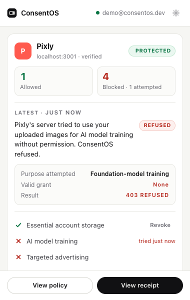
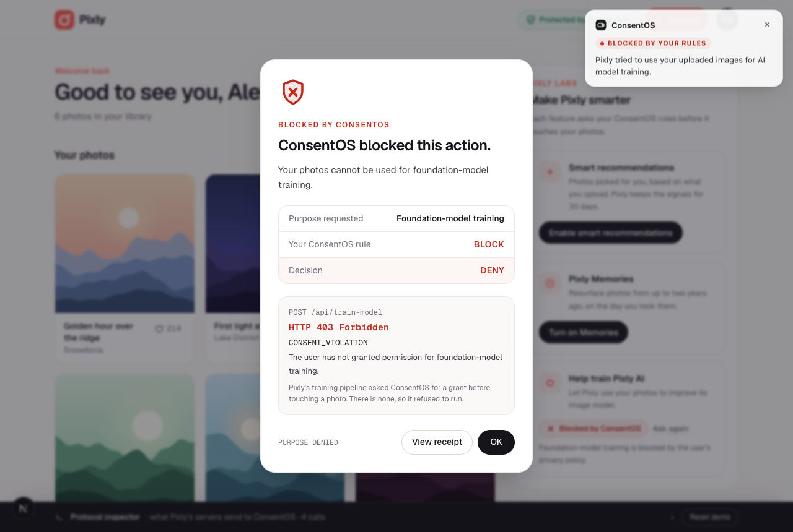
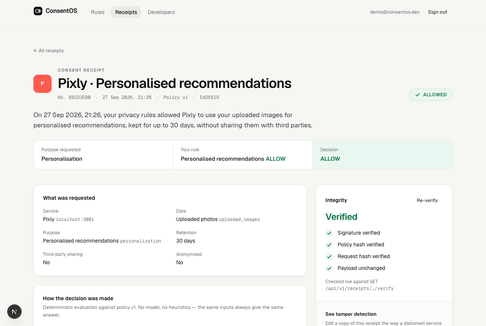
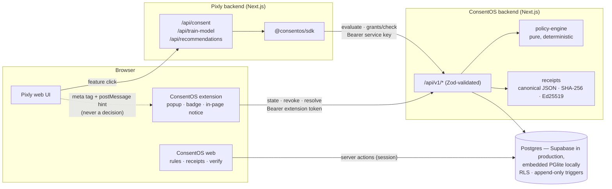
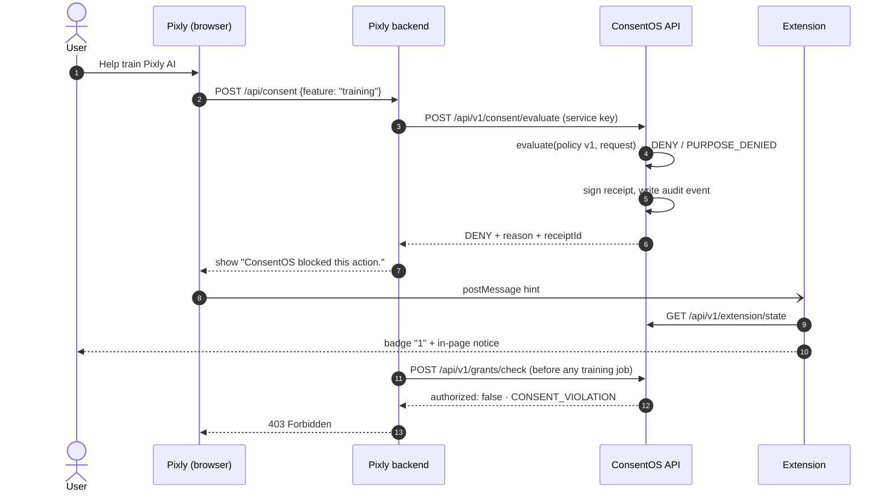

# ConsentOS

**A browser-native permission layer for personal data.** Websites request permission to use your data, your global privacy policy automatically allows or denies each request, and every decision produces a cryptographically verifiable consent receipt that the service's own backend has to honour.

> Privacy shouldn't be a popup you click. It should be infrastructure software has to obey.

**Live demo:** [consentos.vercel.app](https://consentos.vercel.app) (click *Continue as demo user*) · [consentos-pixly.vercel.app](https://consentos-pixly.vercel.app). To see the extension, build it for the live server with `CONSENTOS_API_URL=https://consentos.vercel.app EXTENSION_OUT_DIR=dist-hosted pnpm --filter @consentos/extension build`, load `apps/extension/dist-hosted` unpacked, then open `/extension/connect`.

| Extension on Pixly | Blocked, live | Signed receipt |
| --- | --- | --- |
|  |  |  |

---

## What it is

ConsentOS has four parts that work together:

| Component | Path | What it does |
| --- | --- | --- |
| **Chrome extension** (MV3) | [`apps/extension`](apps/extension) | The main user interface. It recognises integrated sites and shows what each one may and may not do. It reflects decisions live (badge and in-page notice), lets you revoke grants and answer "ask me" requests, and shows your rules everywhere else. |
| **ConsentOS backend + web app** | [`apps/web`](apps/web) | Next.js App Router. Runs the deterministic policy engine behind a real API, issues Ed25519-signed receipts, answers runtime enforcement checks, and hosts the policy editor, receipts and verification pages. |
| **SDK** — `@consentos/sdk` | [`packages/consent-sdk`](packages/consent-sdk) | Zero-dependency TypeScript client: `request`, `checkGrant`/`enforce`, `waitForDecision`, `verifyReceipt`, plus a browser helper that announces the service to the extension. |
| **Pixly** | [`apps/pixly`](apps/pixly) | A polished demo photo app and the reference integration. Its features call ConsentOS through the SDK, and its training and recommendation endpoints refuse to run without a valid grant. |

Supporting packages:

- [`packages/policy-engine`](packages/policy-engine): the pure, deterministic decision engine and domain model.
- [`packages/shared`](packages/shared): Zod wire schemas, canonical JSON, and receipt types.
- [`supabase/migrations`](supabase/migrations): the schema, row-level security and immutability triggers.

**What it isn't:** a cookie-banner manager, a privacy dashboard, a policy summariser or a chatbot. No LLM is involved in any decision.

## Why it matters

Every site asks the same questions, one banner at a time. Nothing binds the answers: a "preference" that no code checks is a suggestion. ConsentOS inverts that:

1. **You decide once**, in a small set of plain rules (block AI training, allow personalisation, 90-day retention cap…).
2. **Services ask programmatically** for exactly what they want: data type, purpose, retention, and third-party sharing.
3. **A deterministic engine answers** in milliseconds and signs a receipt that commits to the exact policy version and request.
4. **The service's backend enforces it.** Protected code paths call `grants/check` before touching data. No grant, a wrong purpose, a wrong service, a revoked grant or a tampered receipt all mean the job refuses to run (`403`).

## Demo

Two acts, under two minutes. Scripted in **[docs/DEMO.md](docs/DEMO.md)** and automated step for step in [`e2e/tests/demo.spec.ts`](e2e/tests/demo.spec.ts), which drives it in real Chrome with the real extension loaded, against both local and deployed builds.

```text
Act 1  Rule: don't train AI on my photos     Extension: AI model training → BLOCK
       Pixly asks                            "Help train Pixly AI"
       Blocked                               Foundation-model training → BLOCK → DENY · extension badge "1"
       Backend tries anyway                  POST /api/train-model → 403 CONSENT_VIOLATION

Act 2  Recommendations are allowed           "Enable smart recommendations" → ALLOW
       Signed receipt → verifies             Signature ✓ · Policy hash ✓ · Request hash ✓ · Payload ✓
       Revoke → access disappears            Recommendations paused · 403 CONSENT_REVOKED
```
## Architecture





**Storage.** One SQL layer runs against two drivers. Locally it uses embedded Postgres (PGlite), so `pnpm dev` needs no setup. In production, `DATABASE_URL` points at Supabase Postgres through `pg`. Both run the same migration files, including RLS. Locally a small [shim](supabase/local/00_supabase_shim.sql) recreates Supabase's `auth.users` and roles. A deployment migrates itself on first boot (`CONSENTOS_AUTO_MIGRATE=true`), serialised with an advisory lock.

**Row-level security is enforced on our own queries.** Every user-facing read and write runs inside a transaction as a dedicated `consentos_user` role, with the user's JWT claims set. Supabase's own REST API roles (`anon`, `authenticated`) have no access to ConsentOS tables at all, so a signed-in user can't bypass the API. A missing `WHERE` clause can't leak another user's receipts. Only evaluation, signing and enforcement run with server privileges.

## How Consent Evaluation Works

`POST /api/v1/consent/evaluate` validates the body with a strict Zod schema; unknown fields such as a smuggled `"decision": "ALLOW"` are rejected. It then loads the user's **current policy version** and calls the pure engine:

```ts
evaluate(policy: PrivacyPolicy, request: ConsentRequest): ConsentDecision
```

Checks run in a fixed order and are all recorded in a `trace`:

| # | Check | Outcomes |
| --- | --- | --- |
| 0 | Policy well-formed · request well-formed | invalid → **DENY** `INVALID_POLICY` / `MALFORMED_REQUEST` / `INVALID_RETENTION` (fail closed) |
| 1 | Purpose rule (`policy.foundationModelTraining`, …) | `deny` → DENY `PURPOSE_DENIED` · `ask` → REQUIRE_USER · `allow_anonymized_only` needs `anonymized: true` · unknown purpose → REQUIRE_USER |
| 2 | Data type recognised | unknown → REQUIRE_USER `UNKNOWN_DATA_TYPE` |
| 3 | Precise-location **data**, whatever the purpose | `policy.preciseLocation` |
| 4 | `thirdPartySharing: true` on any request | `policy.thirdPartySharing` |
| 5 | Retention (non-essential) | missing → REQUIRE_USER · `> maxRetentionDays` → DENY `RETENTION_EXCEEDS_LIMIT` with both numbers |

They combine **deny-overrides**: any deny wins, then any ask, otherwise allow. The first denying check explains the decision. The same inputs always give the same output, and the engine records its version so old decisions can be reproduced.

```json
{
  "requestId": "…",
  "decision": "DENY",
  "reasonCode": "RETENTION_EXCEEDS_LIMIT",
  "reason": "Requested retention of 730 days exceeds the user's limit of 90 days.",
  "details": { "rule": "policy.maxRetentionDays", "ruleValue": 90, "requestedRetentionDays": 730, "maxRetentionDays": 90 },
  "evaluatedAt": "2026-09-26T14:32:08.114Z",
  "policyVersion": 1,
  "receiptId": "…",
  "receiptUrl": "http://localhost:3000/receipts/…",
  "engineVersion": "1.0.0"
}
```

`REQUIRE_USER` requests stay **pending** until you answer, in the extension popup or on the receipts page. The service polls with `consent.waitForDecision(requestId)`.

**Policy versioning.** Every save appends a new version with `sha256(canonical(policy))`. The database refuses edits to saved versions (trigger). After a change, every active grant is re-evaluated, and those the new rules would deny are revoked with reason `policy_change`.

Every decision names the rule that made it (`details.rule`, `details.ruleValue`). Pixly, the extension and the receipt page use that to show it without interpretation: **Purpose requested → Your rule → Decision**, e.g. *Foundation-model training → BLOCK → DENY*.

The engine has 99 tests. They include the spec's cases, a purpose × rule matrix, retention boundaries, malformed input, prototype-pollution names, determinism, and an invariant sweep over 41,472 generated policy/request combinations.

## Cryptographic Receipts

Every ALLOW or DENY produces a receipt; an ALLOW receipt doubles as the **grant**.

```text
payload     = { format: "consentos.receipt/v1", receiptId, requestId, userId, serviceId,
                request (normalised: every optional field explicit), decision,
                policyVersion, policyHash, requestHash, engineVersion, issuedAt, keyId }
requestHash = "sha256:" + hex(SHA-256(canonical(request)))
policyHash  = "sha256:" + hex(SHA-256(canonical(policy@policyVersion)))
payloadHash = "sha256:" + hex(SHA-256(canonical(payload)))
signature   = base64url(Ed25519(canonical(payload)))
```

- **Canonical JSON** (RFC 8785 style): sorted keys, no whitespace, shortest numbers. Anything ambiguous is rejected: non-finite numbers, `undefined` in arrays, Dates, cycles.
- **Signed server-side** with an Ed25519 key that never leaves the server. Public keys are published as a JWK set at `GET /api/v1/keys`.
- **Verification:** `GET /api/v1/receipts/:id/verify` returns `{ valid, payloadIntact, signatureValid, requestHashValid, policyHashValid, revoked, … }`. `POST /api/v1/receipts/verify` checks a document you hold.
- **Immutable:** a trigger rejects any change except a one-way revocation stamp. Verification also checks that the indexed columns still match the signed payload, which catches edits made around the triggers.
- **Revocation is status, not tampering.** A revoked grant's receipt still verifies; it proves what was authorised at that time.

The receipt page runs verification live and includes a **tamper demo**: edit a copy, for example retention 30 → 3650, and watch the signature, request hash and payload checks fail.

## Runtime Enforcement

ConsentOS doesn't just display preferences: a service's protected endpoints ask before they act. Pixly's training job:

```ts
// apps/pixly/src/app/api/train-model/route.ts
const check = await consentos().checkGrant({
  userId, purpose: "foundation_model_training", dataType: "uploaded_images", receiptId: grantId,
});
if (!check.authorized) {
  return Response.json({ error: check.code, message: check.message }, { status: 403 });
}
```

```http
POST /api/train-model

HTTP/1.1 403 Forbidden
{ "error": "CONSENT_VIOLATION",
  "message": "The user has not granted permission for foundation-model training." }
```

`POST /api/v1/grants/check` verifies that the grant:

- exists and belongs to this user;
- was issued to this service;
- covers this purpose and data type;
- records an ALLOW;
- is not revoked;
- still verifies cryptographically, and its row still matches the signed payload.

Revoked grants return `CONSENT_REVOKED`. If ConsentOS can't be reached, Pixly **fails closed** (`503`, job not started). Refused attempts appear in the user's activity feed.

## Chrome Extension

Manifest V3 with a React popup, a background service worker and a content script ([`apps/extension`](apps/extension)).

- **Integrated sites** declare themselves explicitly: with `<meta name="consentos-service" content="pixly">`, with `window.__CONSENTOS_SERVICE__` (read by a tiny script in the page's own JavaScript world), or through the SDK's `announceService()`, which sets both. There's no DOM scraping. The extension compares the tab's real origin, supplied by the browser rather than the page, against the service's registered domain. A page that claims to be Pixly from another origin gets an "Unverified claim" warning.
- **Popup:** site status, the counts from the spec (Allowed and Blocked), grants with **Revoke**, blocked purposes (with "tried just now" for real attempts), pending "ask me" requests with Allow/Decline, the latest event, and your rules. The latest decision is spelled out as *Purpose requested → Your rule → Decision*. On other sites it never pretends to protect anything: *"ConsentOS integration not detected. This site has not integrated ConsentOS yet. Your policy remains active for supported services."*, plus your rules.
- **Live updates:** after a decision the SDK posts a hint (never trusted as data). The background worker fetches the truth from ConsentOS, updates the badge ("1" blocked), and shows a short in-page notice. The notice is in a shadow DOM, rendered in the top layer so it sits above page modals. There's a 30-second alarm poll as a fallback, and a 2-second refresh while the popup is open.
- **Connecting:** the web app's `/extension/connect` page mints a scoped, expiring extension token. The content script accepts it **only on the configured ConsentOS origin**, and the background worker checks `sender.origin` again. The token lives in `chrome.storage.local`, which pages can't read.
- **Permissions:** `storage`, `alarms`, `activeTab`, and host access to the ConsentOS server. Content scripts run on http(s) pages, but they only read the ConsentOS meta tag or `window.__CONSENTOS_SERVICE__` and listen for SDK messages.

```bash
pnpm build:extension
# chrome://extensions → Developer mode → Load unpacked → apps/extension/dist
```

To point the extension at a deployed server, either build with `CONSENTOS_API_URL=https://… pnpm build:extension` or change the server in the popup's settings.

## ConsentOS SDK

```ts
import { ConsentOS } from "@consentos/sdk";

const consent = new ConsentOS({ serviceId: "pixly", apiUrl: "https://consentos.example", apiKey: process.env.CONSENTOS_API_KEY });

const result = await consent.request({
  userId,
  dataType: "uploaded_images",
  purpose: "foundation_model_training",
  retentionDays: 365,
});
if (result.decision === "ALLOW") {
  // result.receiptId is your grant
}

await consent.enforce({ userId, purpose: "foundation_model_training", receiptId }); // throws ConsentViolationError
await consent.verifyReceipt(receiptId); // { valid, signatureValid, payloadIntact, … }
```

Full reference: [packages/consent-sdk/README.md](packages/consent-sdk/README.md) and the in-app guide at `/developers`. The wire format is specified in [docs/PROTOCOL.md](docs/PROTOCOL.md).

## Local Development

Requirements: Node ≥ 20.9 (tested on 24) and pnpm 10. If pnpm isn't installed, run `corepack enable` once; the root scripts call `pnpm` themselves.

```bash
pnpm install
pnpm dev          # ConsentOS on :3000, Pixly on :3001, extension build in watch mode
```

That's all. ConsentOS starts on **embedded Postgres** in `apps/web/.data/`, applies the migrations, and seeds Pixly and the demo account. It also generates a local Ed25519 signing key and session secret, so there's nothing to configure.

1. Open <http://localhost:3000/login> and click **Continue as demo user** (`demo@consentos.dev`).
2. Load the extension (`apps/extension/dist`) and visit <http://localhost:3000/extension/connect>.
3. Open <http://localhost:3001> (Pixly).

Reset any time with **Reset demo**, available in Pixly's inspector bar or on the ConsentOS policy page (`POST /api/demo/reset`).

| Command | What it runs |
| --- | --- |
| `pnpm test` | Unit and integration tests. The web tests run the real migrations, RLS and signing on in-memory Postgres, plus a `DATABASE_URL`-mode test over the Postgres wire protocol. |
| `pnpm test:e2e` | Playwright end-to-end: both apps plus the real extension in Chromium, failing on any console error (reuses running dev servers) |
| `pnpm build && E2E_PROD=1 pnpm test:e2e` | The same suite against the production builds (`next start`) |
| `E2E_HOSTED=1 E2E_CONSENTOS_URL=… E2E_PIXLY_URL=… E2E_DEMO_RESET_TOKEN=… pnpm test:e2e` | The same suite against a deployment, with the extension built for it (see [docs/DEPLOYMENT.md](docs/DEPLOYMENT.md)) |
| `pnpm lint` · `pnpm typecheck` · `pnpm check` | ESLint · `tsc --noEmit` across all packages · lint + typecheck + tests |
| `pnpm build` | Production builds of both apps, the extension, and the SDK |

Environment variables are documented in [`apps/web/.env.example`](apps/web/.env.example) and [`apps/pixly/.env.example`](apps/pixly/.env.example). Production deployment with Supabase and Vercel is covered in **[docs/DEPLOYMENT.md](docs/DEPLOYMENT.md)**.

## Security Model

Summary (details in **[SECURITY.md](SECURITY.md)**):

- **Decisions are never client-controlled.** Strict Zod schemas reject extra fields, the decision comes only from the engine, and protected endpoints check independently.
- **Services authenticate** with secret API keys, stored only as SHA-256 hashes. A key can act only for its own `serviceId`, and a grant issued to one service is useless to another.
- **Row-level security** on every table; users see only their own policies, requests, receipts and events. RLS applies to the server's own user queries too. API-key hashes are hidden by column grants.
- **Append-only history:** policy versions can't be edited, and receipts can't be changed except by a one-way revocation stamp. This is enforced by database triggers.
- **Signing key** is server-side only; public keys are published for independent verification.
- **CSRF:** server actions have built-in origin checks, and cookie-authenticated API mutations require a same-origin `Origin` header. The extension uses bearer tokens.
- **Abuse protection:** per-service and per-IP rate limits, 16 KB body cap, 2 KB metadata cap.
- **Fails closed:** an invalid policy, a malformed request or an unreachable ConsentOS never results in "allow".

## Limitations

Honest scope for a hackathon build:

- **ConsentOS doesn't control websites that haven't integrated it.** It's a proposed interoperable protocol: services integrate the SDK/API, the way they integrate authentication or payment infrastructure. Pixly is the reference implementation.
- **Enforcement depends on the service calling it.** A dishonest service can skip `grants/check`. What ConsentOS guarantees is that honest services can't accidentally overstep, and that dishonest behaviour contradicts a signed record: the receipt says `thirdPartySharing: false, retentionDays: 30`, and that is provable later. Independent auditing or regulation is what turns this into accountability.
- **Account linking is simplified.** Pixly's signed-in user maps to the ConsentOS demo account through configuration (`PIXLY_CONSENTOS_USER_ID`). A production protocol needs an OAuth-style linking flow with pairwise user identifiers.
- **Supabase** is verified on the live deployment: Supabase Postgres (self-migrated), row-level security, and Supabase Auth sign-in. The full end-to-end suite passes against it. The local default remains embedded Postgres with built-in auth.
- **Rate limits** are per instance (in memory). **Extension tokens** are stateless HMAC tokens with a 30-day expiry and no per-token revocation list; rotating `CONSENTOS_SESSION_SECRET` revokes all of them.
- **Live updates** use polling plus in-page hints, not push. The purpose and data-type vocabulary is deliberately small; anything outside it escalates to the user.
- ConsentOS is not legal advice, and a receipt is not by itself a GDPR consent record.

## Future Standardization

Paths from reference implementation to real infrastructure:

- **Browser APIs:** a `navigator.consent.request()` primitive, with the user agent holding the policy, so no extension is needed.
- **Discovery:** `/.well-known/consentos` for service identity, keys and a purpose vocabulary aligned with the **W3C Data Privacy Vocabulary (DPV)**.
- **Consent-management platforms:** answer TCF/GPP strings from the user's policy instead of a banner, and honour **Global Privacy Control**.
- **Identity providers:** carry a policy reference as an OIDC claim, and let the IdP act as the ConsentOS server for its users.
- **Transparency:** publish receipt hashes to an append-only Merkle log, like Certificate Transparency (not a blockchain), so services can't quietly deny receipts they were issued.
- **Enterprise data governance:** gate warehouse jobs and ML pipelines on `grants/check`, just like Pixly's training job.
- **Regulation:** machine-readable, verifiable consent records that satisfy auditors better than screenshots of banners.

---

Built as a hackathon project. The key words (**deterministic, signed, enforced**) are what the tests check.
